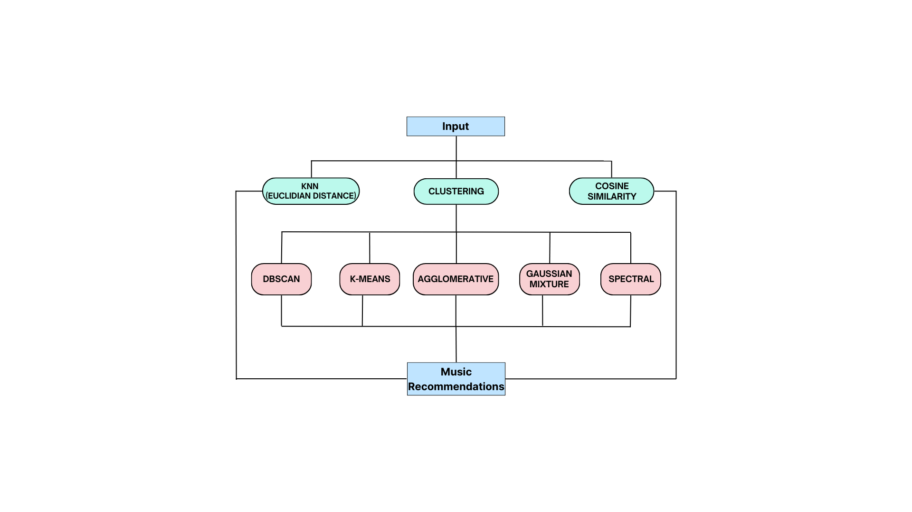
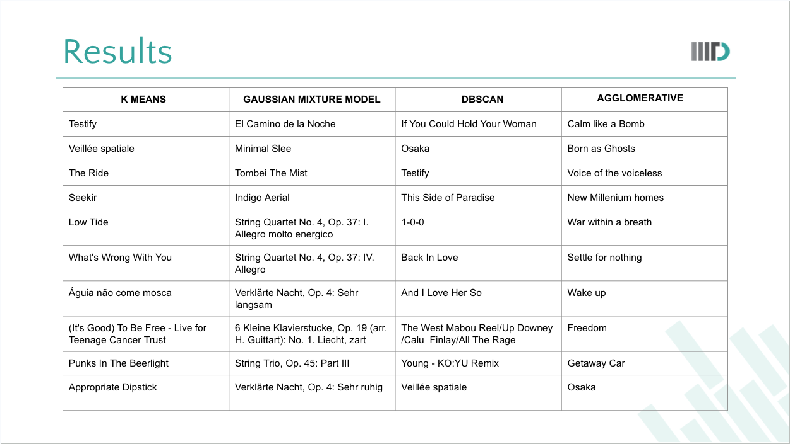

# 🎵 Music Recommendation System using Machine Learning 🤖🎶

 

---------------------------------------------------------------------------------------------------------------------------------------------------------------------------------
**Team Members:**
- Aniket Kanoujia (2021377)
- Ashutosh Gera (2021026)
- Piyush Kumar (2021180)
- Tushar Chandra (2021211)

**Dataset:** [Spotify 1.2M+](https://www.kaggle.com/datasets/rodolfofigueroa/spotify-12m-songs)

**Important Files:**
- `tracks_featues.csv`: Original dataset (deleted due to size constraints)
- `final.csv`: Processed dataset
- `tsne1.2.csv`: T-SNE of the whole dataset (took around 15 hrs to run 😅).

For any queries, feel free to reach out! 🚀

---------------------------------------------------------------------------------------------------------------------------------------------------------------------------------

## Overview 🎉

Our project grooves to the beat of creating a Music Recommendation System using Machine Learning. 🕺 We stand out by spinning unsupervised models that predict song recommendations based on user preferences, creating a more personalized and diverse music listening experience. 🎧

## Methodology/Blueprint 🚀

## Abstract 📝

In a world filled with music, the quest for discovering new artists and tunes is never-ending. Our Music Recommendation System is designed to decode the complexities of recommendation algorithms, focusing on content-based filtering and real-time learning. Unlike mainstream platforms, our project strives to deliver a personalized music recommendation system for individual users, enhancing their overall music listening experience.

## Introduction 🎤

Our project addresses the limitations of existing music recommendation systems, such as limited diversity, popularity bias, and challenges in incorporating user feedback. By leveraging machine learning on audio features, we aim to strike a balance between personalized recommendations and introducing diversity.

## Literature Survey 📚

We draw inspiration from various studies, including:

1. **Dynamic K-means Clustering Algorithm for Music Recommendation**
2. **Personalized Music Recommendation model based on Machine Learning**
3. **Music Recommendation System Using Machine Learning**
4. **Automated Playlist Generation from Personal Music Libraries**

These studies influence our methodology, focusing on dynamic clustering, context-aware recommendation, and correlation analysis.

## Dataset 📊

### Dataset Preparation 🎛️

We utilize the Spotify 1.2M+ dataset, containing audio features of over 1.2 million songs obtained with the Spotify API.

### Dataset Features 🎶

After preprocessing, our dataset includes 16 features, such as danceability, energy, and tempo. We analyze trends across generations and create visualizations, including word clouds and feature trend plots.

## Methodology 💻

### Filtering Techniques 🔍

Our project employs content-based filtering using machine learning algorithms on various audio features. We explore collaborative filtering, content-based filtering, and hybrid filtering.

### Models and Classification 🤖

We implement various machine learning algorithms, including:
- K Nearest Neighbours
- Cosine Similarity
- K Means Clustering
- Gaussian Mixture Model
- DBSCAN
- Agglomerative Clustering
- Spectral Clustering

We provide insights into each algorithm's application and use cases.

### Playlist Generation 🎼

We generate playlists using cluster similarity and feature similarity with content-based filtering. The output songs are obtained through cosine similarity, K Means, Gaussian Mixture Model, DBSCAN, Agglomerative Clustering, and Spectral Clustering.

## Results and Analysis 📈

We present the top recommended songs for a given input song using different algorithms. There is a partial overlap between recommended songs, indicating the effectiveness of our algorithms in suggesting songs with high feature similarity.

## Conclusion 🎉

Our project successfully implements various unsupervised machine learning algorithms to recommend songs based on user input. The partial overlap in recommendations validates the efficacy of our algorithms in providing diverse yet personalized suggestions.

---------------------------------------------------------------------------------------------------------------------------------------------------------------------------------